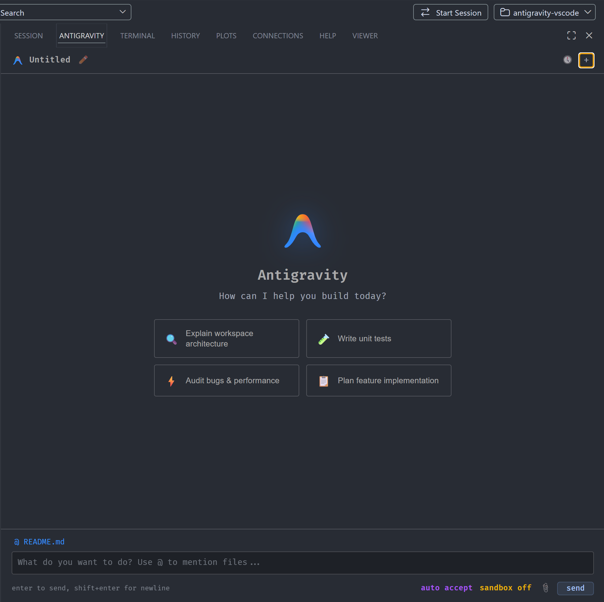
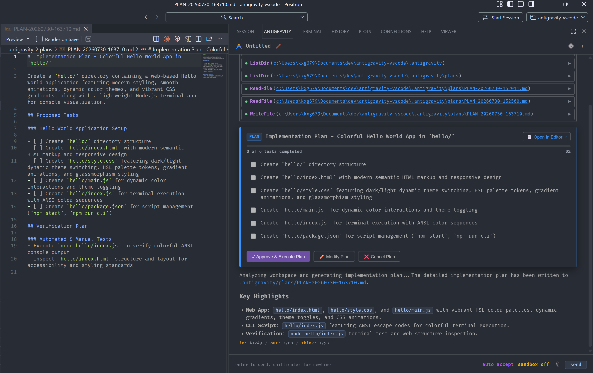
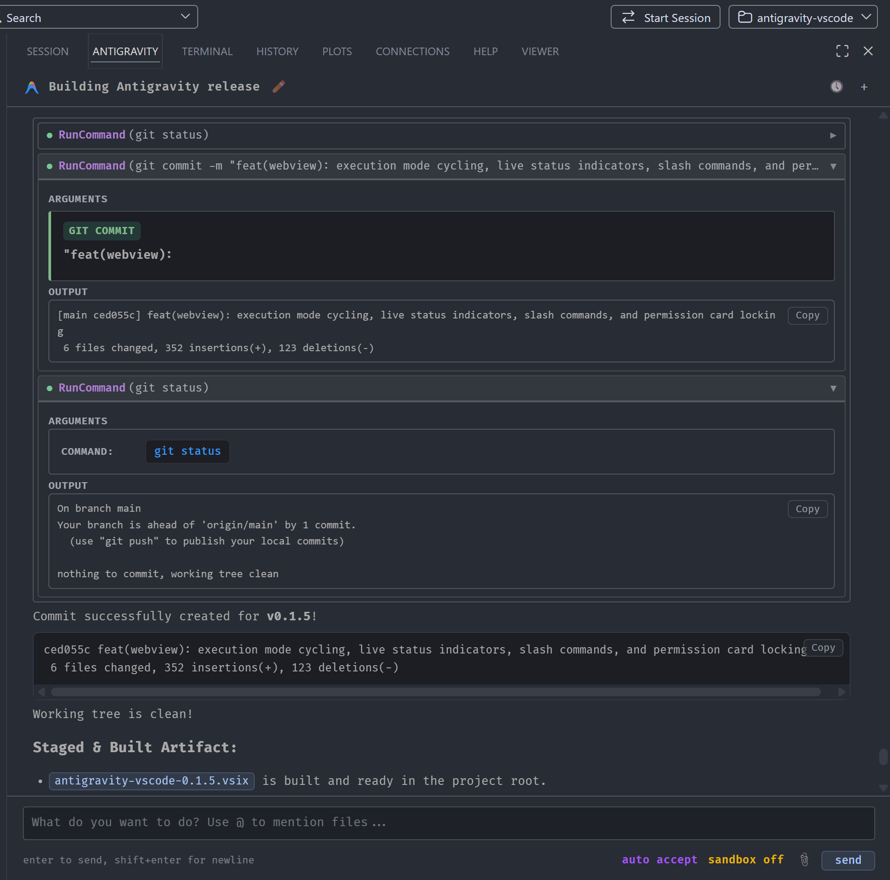
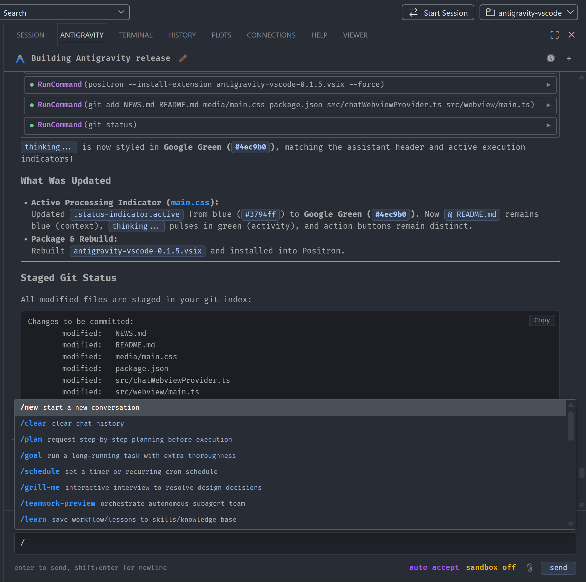

# Antigravity for VS Code

[](https://github.com/kyleGrealis/antigravity-vscode/releases)
[](LICENSE.txt)

Harness the power of **Google Antigravity (`agy`)** directly inside VS Code and Positron.

<p align="center">
  
</p>

---

## Features

- **Interactive Plan Mode**: Type `/plan` anywhere in your prompt to enter a step-by-step planning workflow with progress tracking, approve/modify/cancel actions, and real-time checkbox sync as the agent executes.

<p align="center">
  
</p>

- **Tool Execution Cards**: Clean command code blocks with full terminal output, disclosure chevrons, and per-card elapsed timers for running tasks.

<p align="center">
  
</p>

- **File Edit Diffs**: Red/green before-after diffs for all file edit tools (`WriteToFile`, `ReplaceFileContent`, `MultiReplaceFileContent`). Snapshot-chain diffing tracks successive edits with `git show HEAD` baselines for first edits on tracked files.
- **Side-by-Side Diff Previews**: Inspect proposed changes in native VS Code diff views via `Compare in Editor`.
- **Interactive Mermaid Diagrams**: Theme-adaptive SVG rendering with Code/Diagram toggle, SVG export, and fullscreen pan & zoom.
- **Mid-Turn Steering**: Send follow-up prompts while the agent is working to redirect without losing session context.
- **Workspace Config Injection**: Automatically prepends `.gemini/GEMINI.md` and `.gemini/AGENTS.md` to first-turn prompts for per-project persona and context.
- **Execution Mode Selector**: `Shift+Tab` cycles modes (`Default` > `plan` > `auto accept`) with visual badges.
- **Workspace-Scoped Session History**: History picker filtered by workspace with search, inline renaming, delete, and automatic state restoration on reload.
- **Prompt History**: `Up/Down Arrow` recalls previous prompts, scoped per workspace and persisted across sessions.
- **Live Streaming & Smart Auto-Scroll**: Scroll lock preserves your reading position during active streaming.
- **`@` File Mentions**: Case-insensitive workspace file search and context insertion.
- **Image Support**: Paste or attach screenshots for visual context and UI debugging.
- **Slash Commands & Skills**: Control settings and execute custom agent skills (reads `~/.gemini/skills/`).
- **Orphan Process Cleanup**: Kills stale agy processes on extension deactivate and before session switches.

---

## Web App (agy-web)

The same webview bundle powers a standalone web app deployed via Express/SSE on a remote server. See [README-web.md](README-web.md) for details on the multi-persona web deployment (Qwerty + Milton), Cloudflare Access auth, light/dark theme, and mobile PWA support.

---

## Installation

### From GitHub Release (VSIX)

1. Download the latest `.vsix` file from the [Releases](https://github.com/kyleGrealis/antigravity-vscode/releases) page.
2. In VS Code or Positron, open the Command Palette (`Ctrl+Shift+P` / `Cmd+Shift+P`).
3. Select **Extensions: Install from VSIX...** and choose the downloaded file.

```bash
code --install-extension antigravity-vscode-0.2.1.vsix
# or for Positron:
positron --install-extension antigravity-vscode-0.2.1.vsix
```

---

## Requirements

- **Antigravity CLI (`agy`)**: `>= 1.0.0` (verify with `agy --version`). Must be in your `PATH` or configured via `antigravity.cliPath`.
- **VS Code**: `^1.85.0` or **Positron**: `>= 2024.06.0`

---

## Slash Commands

<p align="center">
  
</p>

| Command | Description |
| :--- | :--- |
| `/plan [description]` | Enter Plan Mode and generate an implementation plan |
| `/sandbox <on\|off>` | Toggle container sandboxing |
| `/dangerous <on\|off>` | Toggle permission auto-approvals |
| `/usage` | Display session token statistics overlay |
| `/new` | Start a fresh conversation session |
| `/clear` | Clear current chat history |
| `/settings` | Open extension settings |
| `/help` | Show available commands and shortcuts |
| `/<skill-name> [args]` | Invoke custom local agent skills |

---

## Keyboard Shortcuts

| Shortcut | Context | Action |
| :--- | :--- | :--- |
| `Enter` | Prompt box | Send message |
| `Shift+Enter` | Prompt box | Insert newline |
| `Shift+Tab` | Prompt box | Cycle execution mode |
| `Up Arrow` | Prompt box (empty) | Recall previous prompt |
| `Down Arrow` | Prompt box (browsing) | Navigate forward through history |
| `@` | Prompt box | Open file search |
| `/` | Prompt box | Open slash command autocomplete |
| `Escape` | During agent work | Cancel the active request |

---

## Extension Settings

| Setting | Default | Description |
| :--- | :--- | :--- |
| `antigravity.cliPath` | `"agy"` | Path or executable name for the Antigravity CLI binary |
| `antigravity.dangerouslySkipPermissions` | `false` | Auto-approve tool permission requests without prompting |
| `antigravity.bypassSandbox` | `false` | Bypass container sandboxing for tool command execution |

---

## Known Issues

> **Binary image files (PNG, JPG, etc.) crash the agy CLI on Windows** (as of agy v1.1.10, August 3 2026 update). When the agent reads a binary image file via `ReadFile`/`view_file`, the session terminates and the conversation is permanently poisoned. Linux is unaffected. Use `/new` to start a fresh session. See [community report](https://discuss.ai.google.dev/t/antigravity-cli-stopped-reading-png-files/177160).

---

## Roadmap

- [x] Workspace-scoped prompt history
- [x] Workspace config injection (`.gemini/GEMINI.md`, `.gemini/AGENTS.md`)
- [x] Orphan process cleanup and session hardening
- [x] Mid-turn model steering
- [ ] Interactive clarification cards for `ask_question` tool calls
- [x] Background task kill via `manage_task` and `manage_subagents`
- [x] Subagent tracking with live badge, timer, and inline kill button
- [x] Font size controls (A-/A+) in web app
- [x] Inline code styling cleanup (borderless)
- [x] Token usage tracking in web app (`/usage` overlay + per-turn usage bar)
- [x] Google Calendar/Gmail MCP integration for morning brief
- [ ] Real-time tool output streaming in extension (buffered by agy upstream; needs trace logging to confirm)

---

## License

[MIT License](LICENSE.txt)

## Contributing

Contributions, feature requests, and bug reports are welcome.

- [Open an issue](https://github.com/kyleGrealis/antigravity-vscode/issues)
- [Submit a pull request](https://github.com/kyleGrealis/antigravity-vscode/pulls)
- [Source code](https://github.com/kyleGrealis/antigravity-vscode)
